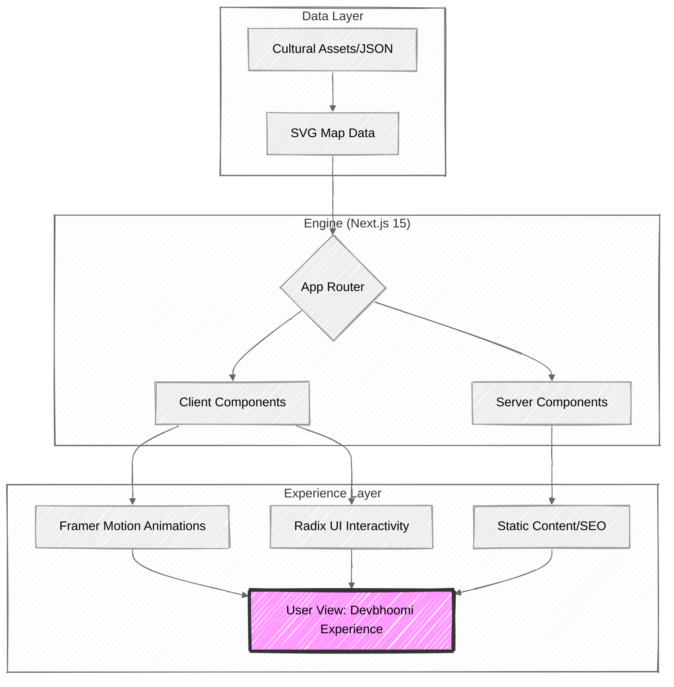

# UttarakhandCulture

Welcome to **UttarakhandCulture**, a digital gateway to the soul of Uttarakhand. This project is dedicated to showcasing the rich heritage, vibrant culture, and breathtaking natural beauty of "Devbhoomi" (Land of Gods).

We aren't just building a website; we're crafting an immersive experience. From the intricate history of local rulers to the rhythm of folk festivals, every pixel here tells a story.

## What's Inside?

This webapp is built to help you explore Uttarakhand in depth:

*   **Interactive Exploration**: Navigate through districts and tehsils with our interactive SVG maps.
*   **Cultural Deep Dive**: Learn about the festivals, fairs, and temples that define the region's spiritual life.
*   **History & Heritage**: Trace the lineage of rulers and the evolution of local languages.
*   **Visual Storytelling**: Experience the state through 3D carousels and curated visual narratives.

## System Architecture

UttarakhandCulture is engineered to be a high-performance "Immersive Experience" engine. Here is how the tech stack orchestrates the data flow:



## Interactive Map Flow

When a user interacts with the digital map of Uttarakhand, the following lifecycle occurs:


## Visual Performance Comparison

| Feature        | Standard Implementation | UttarakhandCulture Approach              |
|---------------|------------------------|------------------------------------------|
| Maps          | Static Images          | Interactive SVGs                         |
| Routing       | Page Reloads           | Next.js App Router (Soft Navigation)     |
| Motion        | Standard CSS           | Framer Motion Orchestration              |
| Accessibility | Basic HTML             | Radix UI Primitives                      |

## Tech Stack

We use modern, robust tools to ensure a smooth and performant experience:

*   **Framework**: [Next.js 15](https://nextjs.org/) (App Router)
*   **Styling**: [Tailwind CSS](https://tailwindcss.com/) with `tailwindcss-animate`
*   **Animation**: [React Motion](https://motion.dev/) for fluid interactions
*   **UI Components**: Built with [Radix UI](https://www.radix-ui.com/) primitives
*   **Icons**: [Lucide React](https://lucide.dev/)

## Getting Started

If you want to run this project locally, here is how you do it.

### Prerequisites

You'll need `node` and `npm` installed. We recommend using the latest LTS version of Node.js.

### Installation

1.  **Clone the repository:**
    ```bash
    git clone https://github.com/ajaynegi45/himalayan-echoes.git
    cd himalayan-echoes
    ```

2.  **Install dependencies:**
    ```bash
    npm install
    ```

3.  **Run the development server:**
    ```bash
    npm run dev
    ```

4.  **Open your browser:**
    Navigate to [http://localhost:3000](http://localhost:3000).

## Project Navigation

For a detailed breakdown of where everything lives in the codebase, check out [FILE_STRUCTURE.md](./FILE_STRUCTURE.md). It will help you orient yourself quickly.

## Contributing

We love contributions. Whether it's fixing a typo, adding new cultural data, or proposing a design overhaul, your help is welcome.

Please read [CONTRIBUTING.md](./CONTRIBUTING.md) to understand our workflow and how to submit a Pull Request.

## Community

This is an open space for everyone. We believe in kindness and respect. Please review our [CODE_OF_CONDUCT.md](./CODE_OF_CONDUCT.md) to understand the standards we uphold in our community.

---

*Built with ❤️ for Uttarakhand.*
